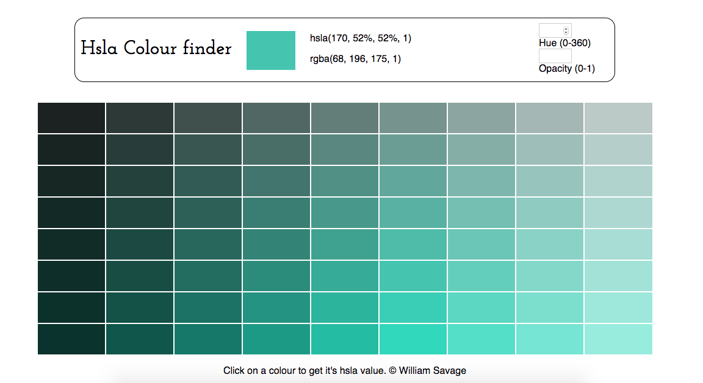

# hsla-colour-swatch :rainbow:

A simple tool for exploring HSLa colours! 

## Usage

1) Simply click on a colour to get its hsla (and rgb) value!

2) Enter values for hue and opacity to generate a new swatch! 

Have fun :smile:

